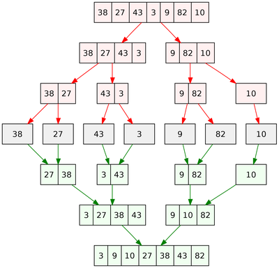

# Big O Notation

**LINKS**

- [Pain and Suffering](https://codefellows.github.io/code-401-python-guide/curriculum/class-01/notes/pain_suffering)
- [Beginners Guide to Big O](https://rob-bell.net/2009/06/a-beginners-guide-to-big-o-notation/)
- [Video:Name and Values in Python](https://rob-bell.net/2009/06/a-beginners-guide-to-big-o-notation/)
- [Awesome Python Enviornment](https://towardsdatascience.com/how-to-setup-an-awesome-python-environment-for-data-science-or-anything-else-35d358cc95d5)
- [Python Module of the Week](https://pymotw.com/3/index.html)

Link Information I added in:

- [Big O Notation and Algorithm Analysis with Python Examples](https://stackabuse.com/big-o-notation-and-algorithm-analysis-with-python-examples/)
- [Big O Cheatsheet](https://www.bigocheatsheet.com/)

## A beginner's guide to Big O notation

Big O notation is used to describe the performance or how complex and algorithm. It specifically describes worst case scinerio in execution time or space used.

### 0(1) Constant Complexity

O(1) describes an algorithm that will always execute in the same time (or space) regardless of the size of the input data set.

```Python
def constant_algo(items):
    result = items[0] * items[0]
    print (result)

constant_algo([4, 5, 6, 8])
```

### O(n) Linear Complexity

O(N) describes an algorithm whose performance will grow linearly and in direct proportion to the size of the input data set. 

```Python
def linear_algo(items):
    for item in items:
        print(item)

linear_algo([4, 5, 6, 8])
```

### O(n^2) Quadratic Complexity

O(n^2) represents an algorithm whose performance is directly proportional to the square of the size of the input data set. Common with nested for loops.

```Python
def quadratic_algo(items):
    for item in items:
        for item2 in items:
            print(item, ' ' ,item)

quadratic_algo([4, 5, 6, 8])
```

### O(2^n)

O(2^n) denotes an algorithm whose growth doubles with each additon to the input data set.An example of an O(2N) function is the recursive calculation of Fibonacci numbers.

```Python
def fibonacci(n):
    if n <= 1:
        return n
    return fibonacci(n-1) + fibonacci(n-2)
```

### O(log N) Logarithms

A Binary search is the most common example. Binary search is a technique used to search sorted data sets. It works by selecting the middle element of the data set, essentially the median, and compares it against a target value. If the values match it will return success.



### Space Complexity

Space complexity which refers to the number of spaces you need to allocate in the memory space during the execution of a program.

```Python
def return_squares(n):
    square_list = []
    for num in n:
        square_list.append(num * num)

    return square_list

nums = [2, 4, 6, 8, 10]
print(return_squares(nums))
```

The function accepts a list of integers and returns a list with the corresponding squares of integers. The algorithm has to allocate memory for the same number of items as in the input list. Therefore, the space complexity of the algorithm becomes O(n).

[Back to Homepage](https://ashcaz.github.io/reading-notes)

